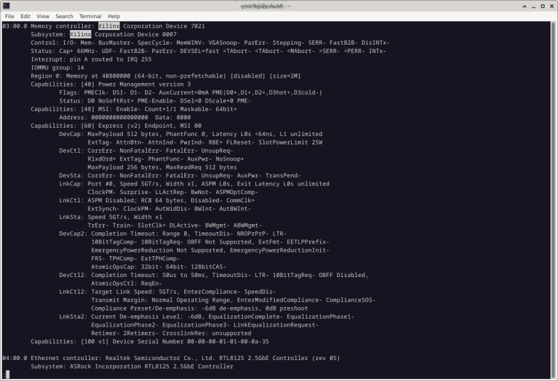
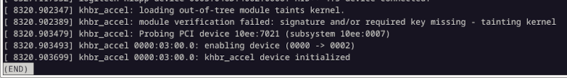
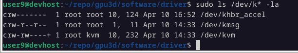

# gpu3d
Learn and build GPU RTL from scratch

1. accel_func - qt-application to understand basic GPU transformations
2. accel_sysc - Precise SystemC model that allows to simulate full soc design or a separate testbenches.
3. rtl - System Verilog source code
4. prj - Makefiles to build rtl for different targets: KC705 board, simulation
5. examples - different application to emulate or interact with the FPGA board

## Hardware

Use 'riscv_vhdl' project and additional IP blocks for KC705 board:

- PCIe endpoint IP.
- HDMI transceivers.


## RTL Simulation

1. Reuse RISC-V CPU with 1 GB DDR from 'riscv_vhdl' project reducing design: 
   1 core, no FPU, minimal I/D caches, no MMU.

2. Successfully run KC705 PCIe simulation tests: PCIe Endpoint, RootHub 
and test application. 5.0GT/s passed.

```
[             4995000] : System Reset De-asserted...
[            54193412] : Transaction Reset Is De-asserted...
[            78469405] : Transaction Link Is Up...
[            78513380] : TSK_PARSE_FRAME on Transmit
[            80145226] : TSK_PARSE_FRAME on Receive
[            86513254] :    Check Max Link Speed = 5.0GT/s - PASSED
[            86513254] : Check Negotiated Link Width = 1x - PASSED
[            86561191] : TSK_PARSE_FRAME on Transmit
[            88193404] : TSK_PARSE_FRAME on Receive
[            94561298] :    Check Device/Vendor ID - PASSED
[            94609341] : TSK_PARSE_FRAME on Transmit
[            96241266] : TSK_PARSE_FRAME on Receive
[           102609392] :    Check CMPS ID - PASSED
[           102609392] : SYSTEM CHECK PASSED
[           102609392] : Inspecting Core Configuration Space...
[           102657356] : TSK_PARSE_FRAME on Transmit
[           104257220] : TSK_PARSE_FRAME on Receive
[           104305319] : TSK_PARSE_FRAME on Transmit
[           105937276] : TSK_PARSE_FRAME on Receive
[           112353380] : TSK_PARSE_FRAME on Transmit
```

3. HDMI tests. Xilinx doesn't provide testbench for HDMI sub-system:

  [IP-Facts](https://docs.xilinx.com/r/en-US/pg235-v-hdmi-tx-ss/IP-Facts)

we'll cobble together something

## Build precise SystemC model

SystemC is provided as a submodule in the folder 'accel_sysc/systemc'.

      $ cd accel_sysc
      $ cmake -S . -B ./build
      $ cd build                (ignore configuration errors and build SystemC libraries)
      $ make
      $ cd ..
      $ cmake -S . -B ./build   (configure again with pre-built systemc libs)
      $ cd build
      $ make

Check file 'accel_sysc/app/main.cpp' and select the desired simulation testbench and duration.
Then re-built and run 'accel_sysc' application as usual executable file.

If you know how to solve 'first configuration error', please share the knowledge.


## First step: Build SoC

Build KC705 FPGA image with the following functionality was successful:

- RISC-V River 64-bits CPU
- DDR memory
- PCIE end-point with access to internal AXI system bus.



## Next steps:

- Implement PCIE driver for Linux. See 'software/driver' folder:

      $ make
      $ make install
      $ sudo modprobe khbr_accel

- dmesg output:



- 'khbr_accel' device in the device folder:



- Implement user application with basic DMA tests. See 'software/userapp' folder:

- Add I2C controller to initialize ADV7511 HDMI transmitter from the bootloader.


## Software

Let's build fully functional PCIe device with the HDMI output
and then will think what to implement as a user application - 
GPU pipeline or AI math. accelerator.

